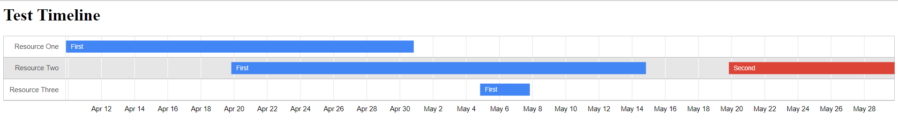

## EC-ReportingTools
Electric Flow Procedures to create reports.  Report links are attached to the job and the pipeline if present.

## Procedures
### json2table
Create a table from a JSON string:
```JSON
[
	{
		"col1": "123",
		"col2": "456",
	},
	{
		"col1": "789",
		"col2": "012",
		"col3": "345"
	}
]
```


#### Parameters
jsonData: required, string, JSON array with one or more key-value pairs for each array element
reportName: optional, string, report name to be used as file name as well

### Timeline
jsonData: required, string, JSON array with items defined by resource, label, startDate, and endData.  Dates should be in YYYY/mm/dd formmat or integer microseconds.
```JSON
[
	{
		"resource": "Resource One",
		"label": "First",
		"startDate":  "2018/4/10",
		"endDate": "2018/5/1"
	},
	{
		"resource": "Resource Two",
		"label": "First",
		"startDate":  "2018/4/20",
		"endDate": "2018/5/15"
	},
	{
		"resource": "Resource Two",
		"label": "Second",
		"startDate":  "2018/5/20",
		"endDate": "2018/5/30"
	},		{
		"resource": "Resource Three",
		"label": "First",
		"startDate":  "2018/5/5",
		"endDate": "2018/5/8"
	}
]
```
reportName: optional, string, Timeline name to be used as file name as well



### Gantt Schedule
jsonData: required, string, JSON array with items defined by taskName, startDate, and endData.
```JSON
[
	{
		"taskName": "First Task",
		"startDate":  "2018/4/10",
		"endDate": "2018/5/1"
	},
	{
		"taskName": "Second Task",
		"startDate":  "2018/4/20",
		"endDate": "2018/5/15"
	},
	{
		"taskName": "Third Task",
		"startDate":  "2018/5/5",
		"endDate": "2018/5/8"
	}
]
```
ganttName: optional, string, Gantt Chart name to be used as file name as well


## Test examples
Run these DSL files to generate tests for the plugin procedures.  These DSL file create both pipelines and procedures in the "Test" project with the same name as the DSL file. Either can be run.  A link to the report will appear on the job and on the pipeline if the pipeline is run.
1. [Simple JSON to Table](dsl/test/json2table.dsl)
1. [Simple Gantt Chart](dsl/test/GanttSchedule.dsl)
1. [Simple Resource Timeline](dsl/test/Timeline.dsl)
1. [Environment and Release Timeline](dsl/test/EnvironmentReleaseTimeline.groovy)
1. [Environment and Release Phase timeline](pages/images/EnvironmentReleasePhasesTimeline.PNG)
1. [Environment Inventory](dsl/test/EnvironmentInventory.PNG)
